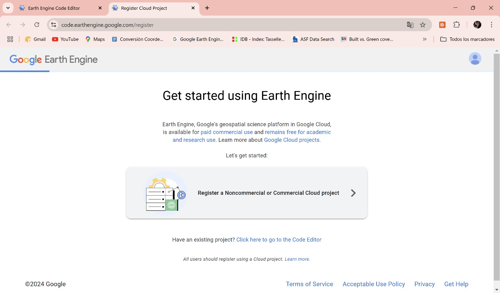
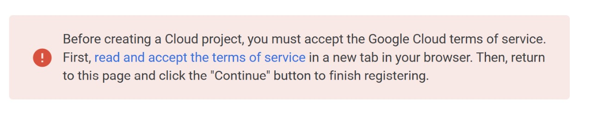
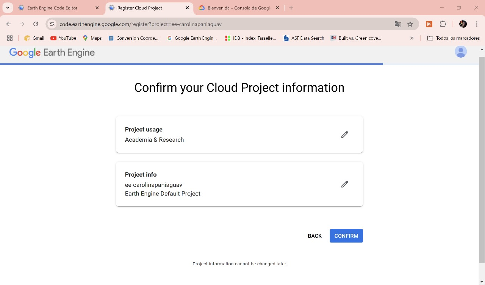

# Bienvenidos al Curso de Ecología del paisaje con énfasis en Ecoacústica

Este curso está diseñado para enseñar conceptos clave de la ecología del paisaje y la ecoacústica, utilizando herramientas computacionales modernas como **Google Colab**.

Los audios pueden ser descargados de: https://drive.google.com/drive/folders/1UJoo2CyV6Ha9UKdP4g4Ei1PjDRyjizgR?usp=sharing

Introducción a Google COLAB: https://www.youtube.com/watch?v=8VFYs3Ot_aA

Etiquetas: https://www.dropbox.com/scl/fi/a8wt7neu5pyqi3g3lyen3/FORMATO_ETIQUETAS.xlsx?rlkey=4h3gkzglqvxd2gpj2w66aijr6&st=s4fanim4&dl=0


# INSTRUCTORES
## Víctor M. Martínez-Arias
Biólogo, MSc. y candidato a Doctor en Bioología con conocimiento y experiencia en ecología espacial y del paisaje, ecoacústica, sistemática de mamíferos, biología de la conservación, ecología animal, colecta y procesamiento de datos. Puede realizar diferentes tipos de análisis de estadística multivariada y espacial, así como manipulación, adquisición y producción de datos SIG, análisis de conectividad ecológica, eocacústica, manejo de bases de datos y escritura científica. Cuenta además experiencia en coordinación de grupos de trabajo, y socialización de proyectos académicos y de consultoría.

## Carolina Paniagua-Villada
Ingeniera ambiental de la Universidad Nacional. Estudiante de Maestría en Biología de la Universidad de Antioquia, su trabajo de investigación está enfocado en complementar el análisis del paisaje físico con técnicas del paisaje sonoro. Tiene experiencia en manejo de datos SIG y modelos de conectividad ecológica. Actualmente, trabaja para la secretaría de Medio Ambiente y Desarrollo Sostenible del municipio de La Estrella, en el área de planteamiento de proyectos para la conservación de la biodiversidad en el municipio.

## Contenido del Curso

El curso cubre los siguientes temas:

1. **Introducción**: Crear carpetas y descargar datos iniciales.
2. **Obtener Datos de Paisaje**: Descargar los datos espaciales.
3. **Índices Satelitales**: Cálculo de métricas a partir de imágenes satelitales.
4. **Fragmentación y Métricas del Paisaje**: Cómo medir la fragmentación y conectividad.
5. **Conectividad Funcional**: Métodos para evaluar la conectividad ecológica.
6. **Autocorrelación Espacial**: Métodos estadísticos espaciales.
7. **Cambio de Nombre de Archivos**: Organización eficiente de datos acústicos.
8. **Biofonías y Diversidad Acústica**: Análisis de diversidad acústica.
9. **Geofonías y Antropofonías**: Exploración de los paisajes sonoros.
10. **Índices Acústicos**: Métricas de análisis acústico.

## Cómo Acceder al Material

Puedes acceder a los notebooks y material del curso desde las siguientes secciones:
  
- [Notebook 1 - Crear Carpeta y Datos Iniciales](https://github.com/vmartinezarias/Curso_Ecologia_Paisaje_y-Ecoacustica/blob/main/1%20-%20Crear_carpeta_y_descargar_datos_iniciales.ipynb)
- [Notebook 2 - Obtener Datos de Paisaje](https://github.com/vmartinezarias/Curso_Ecologia_Paisaje_y-Ecoacustica/blob/main/2%20-%20Obtener_datos_de_paisaje.ipynb)
- [Notebook 3 - Cálculo de Índices Satelitales](https://github.com/vmartinezarias/Curso_Ecologia_Paisaje_y-Ecoacustica/blob/main/3%20-%20Calculo_Indices_satelitales.ipynb)
- [Notebook 4 - Fragmentación y Métricas](https://github.com/vmartinezarias/Curso_Ecologia_Paisaje_y-Ecoacustica/blob/main/4%20-%20Fragmentacion_metricas_paisaje.ipynb)
- [Notebook 5 - Conectividad Funcional](https://github.com/vmartinezarias/Curso_Ecologia_Paisaje_y-Ecoacustica/blob/main/5%20-%20Conectividad_funcional.ipynb)
- [Notebook 6 - Autocorrelación Espacial](https://github.com/vmartinezarias/Curso_Ecologia_Paisaje_y-Ecoacustica/blob/main/6%20-%20Autocorrelaci%C3%B3n_Espacial.ipynb)
- [Notebook 7 - Cambio de Nombre de Archivos](https://github.com/vmartinezarias/Curso_Ecologia_Paisaje_y-Ecoacustica/blob/main/7%20-%20Cambio_nombre_archivos.ipynb)
- [Notebook 8 - Biofonías y Diversidad](https://github.com/vmartinezarias/Curso_Ecologia_Paisaje_y-Ecoacustica/blob/main/8%20-%20Biofonias_Analisis_de_diversidad.ipynb)
- [Notebook 9 - Geofonías](https://github.com/vmartinezarias/Curso_Ecologia_Paisaje_y-Ecoacustica/blob/main/9%20-%20Geofonias.ipynb)
- [Notebook 10 - Antropofonías](https://github.com/vmartinezarias/Curso_Ecologia_Paisaje_y-Ecoacustica/blob/main/10%20-%20Antropofonias.ipynb)
- [Notebook 11 - Índices Acústicos](https://github.com/vmartinezarias/Curso_Ecologia_Paisaje_y-Ecoacustica/blob/main/11%20-%20Indices_Acusticos.ipynb)

## Información Adicional

Este curso está continuamente actualizado, así que asegúrate de seguir revisando esta página para nuevos recursos.

## Contacto

Si tienes dudas o preguntas, por favor contáctame por [GitHub Issues](https://github.com/vmartinezarias/Curso_Ecologia_Paisaje_y_Ecoacustica/issues).

---

### Cómo Configurar el Curso Localmente

Si deseas clonar este curso y ejecutarlo localmente:
1. Clona este repositorio usando Git:
   ```bash
   git clone https://github.com/vmartinezarias/Curso_Ecologia_Paisaje_y_Ecoacustica.git
   
   
   
### CONFIGURACIÓN GEE:
A continuación se muestra el proceso visual de registro en Google Earth Engine (https://earthengine.google.com/)

---

Paso 1



Paso 2


Paso 3




Paso 5



